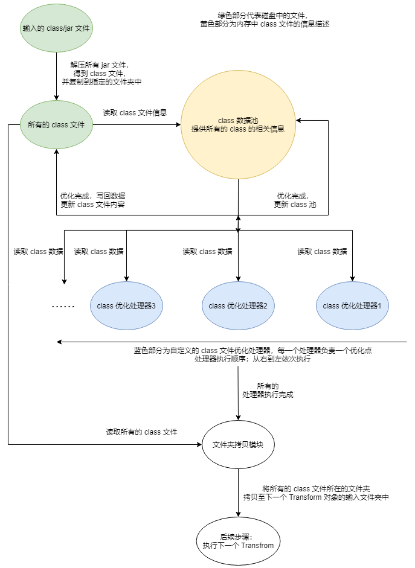
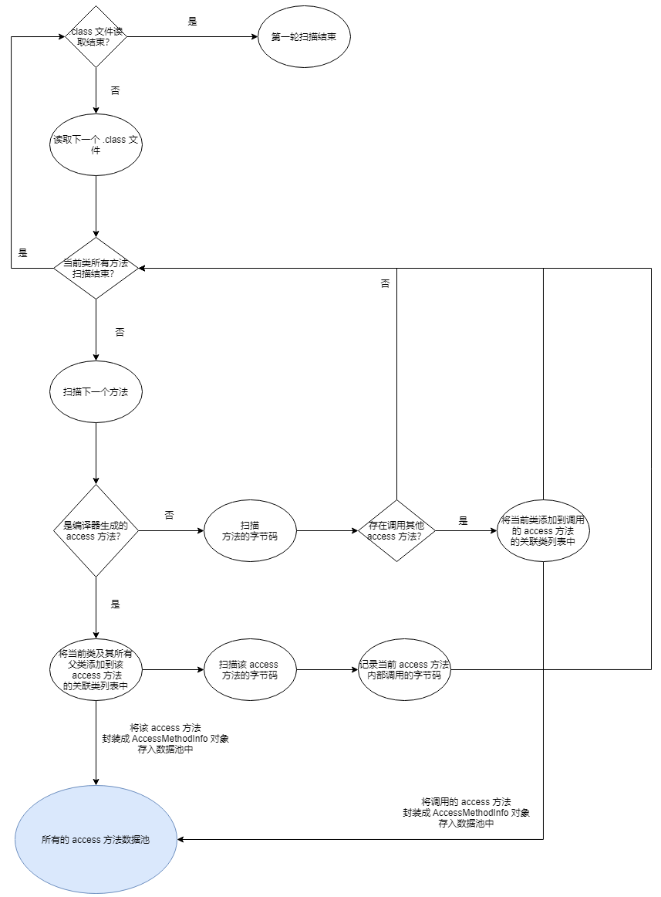

[@TOC]

## 背景

在进行应用宝终端安装包尺寸优化的需求中，发现目前还没有对编译过程中产生的 .class 文件进行优化的 gradle 插件。
而对于大型工程来说，引入对 .class 文件进行优化的 gradle 插件不仅可以对当前存量的代码编译产生的 .class 文件进行优化，
更重要的是在编译流程中插入了一个可以对编译产物进行持续优化的插件，对日后的新增代码具有同样的优化作用。

## 成本和收益
在启用该插件（access 内联、常量字段类文件瘦身、不可见注解移除等功能）的情况下，应用宝灰度/正式版安装包大小缩减 80kb。
同时在新增相同代码量的情况下，相比不使用该插件而言，使用该插件可以缩小安装包尺寸增长的绝对值。
而成本为增加 30s (此为蓝盾构建结果，真实结果随着构建机器性能和内部优化 task 的开启数量变化) 左右的安装包构建时间。

## 注意
在文件名不区分大小写的系统中(Windows)使用时可能出现问题：
在 Windows 系统中，A.class 和 a.class 两个名字被视为同一个文件名，
这两个文件不能存放在同一个目录下，否则后加入的文件会替换掉之前的文件。

而本插件在进行 .class 文件优化之前需要进行外部依赖 jar 文件的解压操作。
这可能导致在解压 jar 文件过程中可能出现同一个目录下有字母相同但是大小写不同的文件会存在相互替换的现象，
导致类缺失问题。

因此该插件只适合开启了文件名大小写敏感的系统(Linux)上使用。

## 使用
在工程中的 app module 中的 buildscript 闭包中的依赖仓库闭包（repositories）中加入该 maven 库：
`https://mirrors.tencent.com/repository/maven/tassistant`

随后在构建依赖闭包（dependencies）中加入如下库的依赖：
```groovy
/* 插件最新版本为 1.2.7 */
classpath 'com.hiro.android:bytecode_slimming:1.2.7'
classpath 'org.ow2.asm:asm:6.0'
```
完成后即可通过 gradle `apply` 函数来使用这个插件：
```groovy
apply plugin: 'com.hiro.android.bytecode_slimming'
```

插件默认会开启所有的优化功能，可通过插件提供的 `bytecodeSlimming` 扩展来自定义行为，语法如下：
```groovy
bytecodeSlimming {
  /* 是否启用整个插件，默认启用 */
  enable = true
  /* 插件 log 过滤级别，级别越高插件打印的 log 越少，共 1,2,3 三个值可选，默认值为 2 */
  logLevel 2
  /* 是否开启 access 方法内联功能，默认开启 */
  slimmingAccessInline true
  /* 是否开启运行时不可见注解去除，默认开启 */
  slimmingNonRuntimeAnnotation true
  /* 是否开启 R 文件瘦身，默认开启 */
  slimmingR true
  /* 不进行 access 方法内联的类名（语法：java 中类全限定名：包名.纯类名）列表，默认为空 */
  keepAccessClass
  /* 要保留的非运行时注解类名（语法：java 中类全限定名：包名.纯类名）列表，默认为空 */
  keepAnnotationClass
  /* 不进行瘦身的 R 文件类名（语法：java 中类全限定名：包名.纯类名）列表，默认为空 */
  keepRClass
  /* 需要进行常量字段内联的类名（语法：java 中类全限定名：包名.纯类名）列表，默认为空列表 */
  slimmingConstantFieldsClass
}
```

## 框架原理

### Android 安装包构建流程

我们先来看一下 Android 安装包的构建流程：


图中的过程省略了很多东西，我们细化一下这个过程在源码编译过程所做的事情：

将工程 module 中的源代码编译为 `.class` 文件，同时和外部依赖库中 `jar` 包一起组成整个代码编译结果集合。而后进行 `proguard` (代码混淆)、`dexbuild` (dex 文件生成) 等过程，最后将得到的一个/多个 `dex` 文件输出到指定目录，用于 apk 文件的合成和签名等。可以用如下的图来描述：


可以看到，在 dex 文件的生成过程中，通过 `javac` 将 Java 源代码编译为 .class 文件后，将 .class 文件转换为 dex 文件都是通过一系列的 `transform` 对象完成的。`Transform` 是 Gradle Android 构建工具为开发者提供的一个可以修改编译得到的 .class/jar 文件的抽象类模型，开发者可通过自定义 `Transfrom` 类并通过对应 API 将该类的对象注册到当前 module 的 Transform 列表中（图中橙色部分为开发者自定义的 `Transfrom` 对象）来实现这个目的。

值得注意的是，所有开发者注册的自定义 `Tranform` 对象都会在官方的 `Transform` 之前执行。每一个 `Transform` 对象的数据输入都是一系列文件/文件夹的描述对象，每一个 `Tranform` 对象都将上一个 `Trasnform` 对象执行的输出结果文件作为输入，同时，每一个 `Transform` 在执行完成后也需要将处理完成后的 class/jar 文件写入下一个 `Transform` 对象的输入文件夹，作为下一个 `Transform` 对象的数据输入。最后，当所有的 `Transform` 对象都执行完成之后，目标的 dex 文件也被构建出来了。 

### 框架架构

本插件本质上也是注册了一个自定义的 `Transform` 对象，在内部将输入的 class/jar 文件进行优化，最后将优化完成的 class 文件写入到下一个 `Transfrom` 的输入文件夹。该 `Transform` 的内部原理如下图：



## 依赖框架

因为所有的优化都是对 `javac` 编译后得到的 `.class` 文件进行的，所以需要一个可以很方便的读取/修改 `.class` 文件（也叫字节码插桩）框架，目前主流的框架有 `Javassist`,  `AspectJ`， `ASM` 等。考虑到安装包编译耗时，在这里选择了性能较优的 `ASM` 框架的 6.0 版本：https://asm.ow2.io/ 。

## 优化点
该插件目前集成了三个优化点：`access 方法内联` 、 `常量字段内联` 和 `运行时不可见注解去除`。
每一个优化点对应框架架构小节图中蓝色部分的 class 优化处理器，理论上来说，class 优化处理器可无限添加。
当前添加的每个优化点的内部原理如下：

### access 方法内联

#### 方法内联

在开始之前我们先了解一下什么是方法内联。方法其实是对一段重复代码的抽象。而方法内联就是将方法内的代码 "还原" 回去，例：

```java
void methodA(/*args*/) {
	// 代码行 A
	// 代码行 B
	// 代码行 C
}

int main() {
    // 三行代码（A、B、C）被优化为一条方法调用指令
    methodA(/* args */);
    // 三行代码（A、B、C）被优化为一条方法调用指令
    methodA(/* args */);
    // ...
    return 0;
}

/** 将 methodA 方法内联后： */

int main() {
    // 代码行 A
	// 代码行 B
	// 代码行 C
    // 代码行 A
	// 代码行 B
	// 代码行 C
    
    // ...
    return 0;
}
```

乍一看方法内联后明明增加了代码的行数，编译后得到的可执行文件应该变大了才对，何来通过方法内联来优化安装包大小的说法呢？我们需要知道在可执行二进制文件中一个方法需要一些额外的数据空间来储存方法本身的属性信息（方法名、返回值类型、参数类型、调用时需要的栈内存大小...），以 `.class` 文件为例：


对应的源代码：

```java
public class SourceClass {

    public void sayHello() {
        System.out.println("Hello");
    }
    
    // ...
}
```

方法的相关信息可以通过一个 `method_info` 的结构体来描述，在编译时这个结构体被序列化后写入 `.class` 文件中。所以只要新增一个方法，就至少会在 `.class` 文件中新增一个 `method_info` 结构体大小的空间占用。

因为方法调用本身需要使用一条指令，所以只有当某个方法内部指令数大于 1，并且这个方法的调用次数大于 1 时，这个方法**才有可能**对编译后得到的可执行文件大小有优化作用。如果一个方法内部的指令只有一条，或者该方法只被调用了一次，那么存储这个方法本身属性所占用的空间反而是增大了可执行文件的大小。


至此我们已经有了结论：从理论上来说，我们可以找那些短方法和调用次数只有 1 次的方法进行内联来减少可执行文件的大小。但是生产环境下我们可以这么直接一刀切吗？

不能! 为什么呢？方法是有可能被反射/插件调用的。如果内联的方法在源码层恰好被反射/插件调用了，那么运行时必然抛出 `NoSuchMethodException` 异常，最致命的是没办法在编码期间就给开发者提示说哪些方法会被内联，因为内联处理发生在 `.class` 文件编译完成后，即使生成内联结果文档也需要在整个内联结束之后。

这么一看，如果要保证绝对的效率和安全，貌似我们什么方法也不能内联。是不是无法通过方法内联来达到缩小可执行文件大小的目的呢？

也不尽然，换一个角度，对于一些 `javac` 编译器自动为我们生成的方法，并且我们在代码中不会主动调用到的方法，我们还是可以进行内联的。那么有哪些方法是 `javac` 编译器自动为我们生成的方法呢?

#### access 方法

我们先看一段代码：

```java
public class InnerClassTest {
     
    int field1 = 1;
    private int field2 = 2;
     
    public InnerClassTest() {
        InnerClassA inner = new InnerClassA();
        // 外部类直接访问了内部类的 private 字段
        int v = inner.x2;
    }
     
    public class InnerClassA {
        int x1 = field1;
        // 内部类直接访问了外部类的 private 字段
        private int x2 = field2;
    }
}
```

采用 **java8** 语法进行编译，得到了两个 `.class` 文件：`InnerClassTest.class` 和 `InnerClassTest$InnerClassA.class`（内部类会编译成一个单独的类文件）。理论上来说，直接访问一个类的 `private` 字段是非法的。但是我们直接这样写却可以编译通过而不报错，秘密就在 `.class` 文件中：

反编译一下编译后的  `InnerClassTest.class` ：


编译后的类中多了一个名为 `access$100` 的静态方法，这个静态方法是默认访问权限的，用来给内部类访问当前类的 `private` 字段。

再看看编译后的 `InnerClassTest$InnerClassA.class` ：


同样的，多了一个名为 `access$000` 的静态方法，用来给外部类访问当前类的 `private` 字段。同时构造方法中的第 `25` 个字节对应的字节码为 `invokestatic` ，后接常量池中第 `6` 个常量，即为调用的为外部类的 `access$100` 方法。


我们反编译了两个类文件，发现两个类都多了一个以 `access$` 方法开头的静态默认访问权限方法，但是我们在代码里并没有写这两个方法，很显然，这两个方法就是 `javac` 编译器为了保证我们的代码可以符合 `java` 语法规范而帮我们生成的静态方法。


那么，我们已经有一种可以通过内联来减少可执行文件大小的方法了!

#### 内联方案

现在我们的目标变成了如何在不影响功能的前提下将编译完成后的 `.class` 文件中由 `javac` 编译器帮我们生成的 `access` 方法进行内联。因为任何由 `javac` 编译器生成的方法的访问标识(`access_flag`) 都会带有 `ACC_SYNTHETIC` 标记，方法可能存在的标记列表如下：

| 标志名称         | 标志值 | 含义                           |
| ---------------- | ------ | ------------------------------ |
| ACC_PUBLIC       | 0x0001 | 该方法是否为 public 修饰       |
| ACC_PRIVATE      | 0x0002 | 该方法是否为 private 修饰      |
| ACC_PROTECTED    | 0x0004 | 该方法是否为 protected 修饰    |
| ACC_STATIC       | 0x0008 | 方法是否为 static              |
| ACC_FINAL        | 0x0010 | 方法是否为 final               |
| ACC_SYNCHRONIZED | 0x0020 | 方法是否为 synchronized 修饰   |
| ACC_BRIDGE       | 0x0040 | 方法是否为编译器生成的桥接方法 |
| ACC_VARARGS      | 0x0080 | 方法是否接受不定参数           |
| ACC_NATIVE       | 0x0100 | 方法是否为 native              |
| ACC_ABSTRACT     | 0x0400 | 方法是否为抽象方法             |
| ACC_STRICTFP     | 0x0800 | 方法是否为 strictfp            |
| ACC_SYNTHETIC    | 0x1000 | 方法是否为编译器自动生成的     |

所以我们可以通过 `ACC_SYNTHETIC` 这个标记来判断一个 `access` 方法是由 `javac` 编译器自动生成的还是由开发者主动书写的。

我们需要创建一个数据类来保存没一个由编译器自动生成的 `access` 方法的信息：

```groovy
/**
 * 描述 access$xxx 方法信息的类
 */
class AccessMethodInfo {

    /* access$xxx 方法所在的类名 */
    final String className
    /* access$xxx 的方法名 */
    final String methodName
    /* 方法的描述（java 层的方法签名除去方法名） */
    final String desc
    /* access$xxx 方法内部访问(通过 getfield/putfield 指令)的字段 */
    List<OperateFieldInfo> operateFieldInfoList = new LinkedList<>()
    /* access$xxx 方法内部通过 invokespecial 指令调用方法信息 */
    List<InvokeMethodInfo> invokeMethodInfoList = new LinkedList()
    /* 当前 access$xxx 方法内部相关指令列表 */
    List<AbstractInsnNode> instructions = new LinkedList<>()
    /* 关联的类名列表 */
    List<String> relatedClassName = new LinkedList<>()
    
    // ...
}
```

有了这个前提之后，我们需要进行下面的两轮扫描：

1、第一轮扫描，记录所有由编译器自动生成的 `access` 方法的信息



在扫描完成后，access 方法数据池中包含了所有可内联的 access 方法信息。

2、第二轮扫描：


扫描整个 `access` 方法数据池，以每一个 `access` 方法为单位，遍历所有和该 `access` 方法相关的类文件，扫描类文件中的每一个字段和方法，如果当前访问的字段字段/方法是该 `access` 方法中操作的字段/方法，那么需要将这个字段/方法的访问权限改为 `public` 的（为什么是改成 `public` 而不是包访问权限？因为存在内部类访问外部类的父类中 `protected` 字段/方法的情况）。

如果当前访问的是方法并且正好和当前的 `access` 方法相匹配，则需要删除这个方法。否则需要检查该方法内部有无调用当前的 `access` 方法的情况，如果存在，则需要将当前 `access` 方法的调用内联为 `access` 方法内部字节码的直接调用。


完成后，将最终的类数据写入到对应的文件中，整个 `access` 方法内联优化完成。

#### 优化结果

`access` 方法内联方案目前减少了 70kb 的灰度/正式包大小。并且后续再引入类似的 `access` 方法也不用再担心了。


我们再用一个直观的例子来看最终优化的结果，还是以上文给到的代码为例：

```java
public class InnerClassTest {
     
    int field1 = 1;
    private int field2 = 2;
     
    public InnerClassTest() {
        InnerClassA inner = new InnerClassA();
        // 外部类直接访问了内部类的 private 字段
        int v = inner.x2;
    }
     
    public class InnerClassA {
        int x1 = field1;
        // 内部类直接访问了外部类的 private 字段
        private int x2 = field2;
    }
}
```

编译完成后会得到两个 `.class` 文件（`InnerClassTest.class` 和  `InnerClassTest$InnerClassA.class`）。我们可以利用 `javap` 工具反编译这两个类文件。先从类的方法和成员来看：

优化前：


优化后：


可以看到 `field2` 和 `x2` 字段修饰符从 `private` 变成了 `public` ，同时编译器生成的  `access$` 已经消失了。


再从方法字节码的层面看看有何变化，首先是 `com.vane.asm_utils.InnerClassTest#InnerClassTest` 方法，优化前：


注意红框中的字节码，意为调用 `InnerClassTest$InnerClassA#access$000` 方法，即为调用编译器为内部类提供的 `access$000` 方法来完成字段的访问，并将结果 push 到当前方法栈的栈顶。

优化后：


同样式红框中的部分，由原来的 `invokestatic` 字节码变成了 `getfield` 字节码，意为直接取处 `InnerClassTest$InnerClassA` 类中的 `x2` 字段的值并且 push 到当前方法栈的栈顶。即不再需要借助编译器为 `InnerClassTest$InnerClassA` 类生成的 `access$000` 方法即可取得 `InnerClassTest$InnerClassA` 类中 `x2` 字段的值（`InnerClassTest$InnerClassA#x2` 字段已经变成了 `public` 访问权限）。


接下来是 `InnerClassTest$InnerClassA` 类，同样的道理，优化前：


优化后：


### 常量字段类文件瘦身

#### 普通常量字段内联

这个优化点的原理比较简单，`java` 的语法特性中， 如果一个类引用了其他类中静态的基本类型常量和静态的 `java.lang.String` 类型常量字段，那么编译后会将引用的常量值直接塞入引用类的常量池中，并且直接使用常量值本身。换句话说，只要能在编译期间确定变量的值，那么编译器就会进行优化，直接将常量值本身内联到对应的字节码中。

例：

```java
/**
 * 测试常量类，该类提供基本数据类型常量
 */
public class Constants {

    public static final boolean BOOLEAN_CONSTANT = true;

    public static final byte BYTE_CONSTANT = 1;

    public static final char CHAR_CONSTANT = 1;

    public static final short SHORT_CONSTANT = 1;

    public static final int INT_CONSTANT = 1;

    public static final long LONG_CONSTANT = 1L;

    /* 该字段不属于静态常量，因为这段代码会编入 <cinit> 方法中，在虚拟机加载这个类并动态执行 <cinit> 方法时才能确定该字段的值 */
    public static final long CURRENT_TIME = System.currentTimeMillis();

    public static final float FLOAT_CONSTANT = 1F;

    public static final double DOUBLE_CONSTANT = 1D;

    public static final String STRING_CONSTANT = "1";

    public static final int[] INT_ARRAY_CONSTANT = new int[]{1, 2, 3, 4, 5};
}

/**
 * 常量读取类
 */
public class ConstantReader {

    public static void main(String[] args) {
        boolean b = Constants.BOOLEAN_CONSTANT;
        System.out.println(b);

        byte by = Constants.BYTE_CONSTANT;
        System.out.println(by);

        char c = Constants.CHAR_CONSTANT;
        System.out.println(c);

        short s = Constants.SHORT_CONSTANT;
        System.out.println(s);

        int i = Constants.INT_CONSTANT;
        System.out.println(i);

        long l = Constants.LONG_CONSTANT;
        System.out.println(l);

        long currentTime = Constants.CURRENT_TIME;
        System.out.println(currentTime);

        float f = Constants.FLOAT_CONSTANT;
        System.out.println(f);

        double d = Constants.DOUBLE_CONSTANT;
        System.out.println(d);
        
        String str = Constants.STRING_CONSTANT;
        System.out.println(str);

        int[] intArray = Constants.INT_ARRAY_CONSTANT;
        System.out.println(intArray);
    }
}
```

编译完成后过后我们可以反编译 `ConstantReader.class` ：

```java
public class ConstantReader {
    public ConstantReader() {
    }

    public static void main(String[] args) {
        /* 直接变成了常量赋值 */
        boolean b = true;
        System.out.println(b);
        /* 直接变成了常量赋值 */
        byte by = 1;
        System.out.println(by);
        /* 直接变成了常量赋值 */
        char c = 1;
        System.out.println(c);
        /* 直接变成了常量赋值 */
        short s = 1;
        System.out.println(s);
        /* 直接变成了常量赋值 */
        int i = 1;
        System.out.println(i);
        /* 直接变成了常量赋值 */
        long l = 1L;
        System.out.println(l);
        /* 运行时动态常量值无法在编译期确定，所以无法内联常量值 */
        long currentTime = Constants.CURRENT_TIME;
        System.out.println(currentTime);
        
        /* 直接变成了常量赋值 */
        float f = 1.0F;
        System.out.println(f);
        /* 直接变成了常量赋值 */
        double d = 1.0D;
        System.out.println(d);
        /* 直接变成了常量赋值 */
        String str = "1";
        System.out.println(str);
        
        int[] intArray = Constants.INT_ARRAY_CONSTANT;
        System.out.println(intArray);
    }
}
```

既然某些常量字段在编译时就会直接将字段值内联到使用地点，那么这些常量字段本身是不是都可以删除了，从而减少安装包大小了呢？从理论上来说是的。

但是在复杂的生产环境中，可能会存在反射调用常量字段值的可能性，如果反射到一个被删除的常量字段，那么就会导致 `NoSuchFieldException` 异常。

所以常量字段内联的功能是否启用需要根据具体的业务场景进行评估。


#### R 文件字段内联

这里的 R 文件指的是 Android 中记录资源 id 的类，R 类中通过一些内部类来保存所有资源 id 值的字段。例：


那么 R 文件类中的常量字段和普通类中的常量字段有什么不同吗？一切都要从 Android 资源打包说起。具体可以参考这篇文章：[关于-r-的一切](https://medium.com/@morefreefg/%E5%85%B3%E4%BA%8E-r-%E7%9A%84%E4%B8%80%E5%88%87-355f5049bc2c)。


从这篇文章中我们知道，`lib module/aar` 中的资源需要等到所属的 `app module` 编译完成后才会生成对应的 `R` 类，一个普通的 `aar` 文件中是不会有 `R` 类的：


但是代码又确实存在资源 id 的引用：


所以依赖这个 `aar` 的 `app module` 在编译打包 apk 时就需要为这个 `aar` 生成一个包前缀名为 `com.zhidian.basic` 的 `R` 类文件。不然运行时就会出现 `NoClassDefFoundError/ClassNotFoundException` 异常。其实不仅是这个 `aar`， `app module` 需要为所有依赖的 `aar/ lib module`（`aar` 本质上还是 `lib module` 的编译产物）生成对应的 `R` 类。而最后的 `apk` 中会存在所有相关的 `R` 类：


**虽然 `app module` 为所有依赖的 `aar/lib module` 生成了对应的 `R` 类文件。但是 `aar` 中的类是不会进行重新编译的，也就是原来 `aar` 中类获取资源 id 的方式为字段引用，在最终的 `apk` 中的形式还是字段引用。**

那么我们是不是可以手动 “帮” 编译器做一次 `R` 类文件中普通 `int` 类型 id 常量字段的内联，然后将内联的常量字段删除，来达到优化安装包大小的目的呢？

我们可以在 `app module` 代码编译完成后，扫描并记录所有的 `R` 类文件中的 `int` 类型常量字段。而后将引用到 `R` 类中的资源 id 字段的字节码(`getfield`) 替换为该字段的直接值。在完成其他类对 `R` 类中的 id 字段引用到对应 id 字段的直接值替换之后，`R` 类中对应的常量字段就可以删除了。从而达到优化安装包大小的目的。

#### 优化效果

对项目中的普通类 `com.tencent.assistant.st.STConstAction`，`com.tencent.assistant.st.STConst` `com.tencent.rapidview.PhotonConst` `com.tencent.rapidview.report.PhotonReportConst`，四个基本/`java.lang.String` 类型常量字段较多的类进行优化的收益大约在 10kb 左右。

`R` 文件字段内联由于项目以前已经存在该功能，本次未接入。

### 运行时不可见注解去除

我们知道一个注解的生命周期有三个级别： 源码级，Classs 文件级，虚拟机运行时。对应的类枚举值：

```java
/* 对应源码层注解，标识该注解只在 java 源代码中存在，不会被编译到 .class 文件中 */
java.lang.annotation.RetentionPolicy#SOURCE
/* 对应 class 文件层注解，标识该注解会被编入 class 文件中，但是不会被虚拟机加载 */
java.lang.annotation.RetentionPolicy#CLASS
/* 对应虚拟机运行时注解，标识该注解会被编入 class 文件中，同时也会被虚拟机加载 */
java.lang.annotation.RetentionPolicy#RUNTIME
```

我们发现 class 文件级别的注解不会被加载到虚拟机中，但是却会被打入 `.class` 文件中，这样的注解是没有运行时意义的，可以被去除。

目前发现生命周期为 class 文件级别的注解有 Android 官方 `android.support.annotation` 和 `androidx.annotation` 包中的注解（两个包中的注解时一样的，只不过 `androidx` 包为 Android 最新制定的扩展库包规范），比较有名的两个注解： `@Nullable` 和 `@NonNull` 就是这个包里面的。

这部分步骤比较简单，只需要遍历类/类方法/类字段/方法参数中的注解，如果是运行时不可见的注解，则直接删除，同时记录注解类名，最后将所有运行时不可见的注解类文件删除即可。

#### 优化效果

由于这部分优化的类文件较少，暂为统计优化效果。


