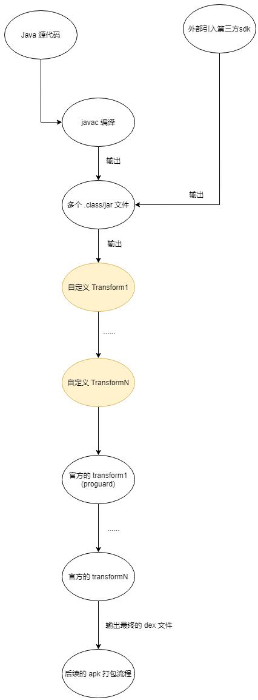

[TOC]

## 背景

在进行应用宝终端安装包尺寸优化的需求中，发现目前还没有对编译过程中产生的 .class 文件进行优化的 gradle 插件。
而对于大型工程来说，引入对 .class 文件进行优化的 gradle 插件不仅可以对当前存量的代码编译产生的 .class 文件进行优化，
更重要的是在编译流程中插入了一个可以对编译产物进行持续优化的插件，对日后的新增代码具有同样的优化作用。

## 成本和收益
在启用该插件（access 内联、不可见注解移除、R 文件瘦身）的情况下，应用宝灰度/正式版安装包大小缩减 100kb。
同时在新增相同代码量的情况下，相比不使用该插件而言，使用该插件可以缩小安装包尺寸增长的绝对值。
而成本为增加 30s (此为蓝盾构建结果，真实结果随着构建机器性能和内部优化 task 的开启数量变化) 左右的安装包构建时间。

## 注意

1、使用该插件需禁用 R8 构建。

2、在文件名不区分大小写的系统中(Windows)使用时可能出现问题：
在 windows 系统中，A.class 和 a.class 两个名字被视为同一个文件名，
这两个文件不能存放在同一个目录下，否则后加入的文件会替换掉之前的文件。

而本插件在进行 .class 文件优化之前需要进行外部依赖 jar 文件的解压操作。
这可能导致在解压 jar 文件过程中可能出现同一个目录下有字母相同但是大小写不同的文件会存在相互替换的现象，
导致类缺失问题。

因此该插件只适合开启了文件名大小写敏感的系统(Linux)上使用。

## 使用
在工程中的 app module 中的 buildscript 闭包中的依赖仓库闭包（repositories）中加入该 maven 库：
`https://mirrors.tencent.com/repository/maven/tassistant`

随后在构建依赖闭包（dependencies）中加入如下库的依赖：
```groovy
/* 插件最新版本为 1.2.7 */
classpath 'com.hiro.android:bytecode_slimming:1.2.7'
classpath 'org.ow2.asm:asm:6.0'
```
完成后即可通过 gradle `apply` 函数来使用这个插件：
```groovy
apply plugin: 'com.hiro.android.bytecode_slimming'
```

插件默认会开启所有的优化功能，可通过插件提供的 `bytecodeSlimming` 扩展来自定义行为，语法如下：
```groovy
bytecodeSlimming {
  /* 是否启用整个插件，默认启用 */
  enable = true
  /* 插件 log 过滤级别，级别越高插件打印的 log 越少，共 1,2,3 三个值可选，默认值为 2 */
  logLevel 2
  /* 是否开启 access 方法内联功能，默认开启 */
  slimmingAccessInline true
  /* 是否开启运行时不可见注解去除，默认开启 */
  slimmingNonRuntimeAnnotation true
  /* 是否开启 R 文件瘦身，默认开启 */
  slimmingR true
  /* 不进行 access 方法内联的类名（语法：java 中类全限定名：包名.纯类名）列表，默认为空 */
  keepAccessClass
  /* 要保留的非运行时注解类名（语法：java 中类全限定名：包名.纯类名）列表，默认为空 */
  keepAnnotationClass
  /* 不进行瘦身的 R 文件类名（语法：java 中类全限定名：包名.纯类名）列表，默认为空 */
  keepRClass
  /* 需要进行常量字段内联的类名（语法：java 中类全限定名：包名.纯类名）列表，默认为空列表 */
  slimmingConstantFieldsClass
}
```

## 框架原理

### Android 安装包构建流程

我们先来看一下 Android 安装包的构建流程：


图中 `Compilers` 过程为将工程 module 中的源代码和外部依赖库编译为 `.class/jar` 文件集，同时包含了 `proguard` (代码混淆)、`dexbuild` (dex 文件生成)、`mergedex`（dex 文件合并）等过程，最后将得到的一个/多个 `dex` 文件输出到指定目录，用于 apk 文件的合成和签名等。这里的 `Compilers` 过程的内部流程可以用如下的图来描述：




可以看到，在 dex 文件的生成过程中，通过 `javac` 将 Java 源代码编译为 .class 文件后，将 .class 文件转换为 dex 文件都是通过一系列的 `transform` 对象完成的。`Transform` 是 Gradle Android 构建工具为开发者提供的一个可以修改编译得到的 .class/jar 文件的抽象类模型，开发者可通过自定义 `Transfrom` 类并通过对应 API 将该类的对象注册到当前 module 的 Transform 列表中（图中橙色部分为开发者自定义的 `Transfrom` 对象）来实现这个目的。

值得注意的是，所有开发者注册的自定义 `Tranform` 对象都会在官方的 `Transform` 之前执行。每一个 `Transform` 对象的数据输入都是一系列文件/文件夹的描述对象，每一个 `Tranform` 对象都将上一个 `Trasnform` 对象执行的输出结果文件作为输入，同时，每一个 `Transform` 在执行完成后也需要将处理完成后的 class/jar 文件写入下一个 `Transform` 对象的输入文件夹，作为下一个 `Transform` 对象的数据输入。最后，当所有的 `Transform` 对象都执行完成之后，目标的 dex 文件也被构建出来了。 

### 框架架构

本插件本质上也是注册了一个自定义的 `Transform` 对象，在内部将输入的 class/jar 文件进行优化，最后将优化完成的 class 文件写入到下一个 `Transfrom` 的输入文件夹。该 `Transform` 的内部原理如下图：


## 优化点
该插件目前集成了三个优化点：access 方法内联、R 文件瘦身和运行时不可见注解去除。
每一个优化点对应框架架构小节图中蓝色部分的 class 优化处理器，理论上来说，class 优化处理器可无限添加。
当前添加的每个优化点的内部原理如下：

### access 方法内联

#### 原理

`access$xxx` 方法主要 `javac` 编译器针对外部类和内部类中互相访问私有字段/方法时为了保证编译出来的 `.class` 文件符合 JVM 虚拟机的要求做出的隐式处理，假设我们有以下代码：

```java
public class InnerClassTest {
     
    int field1 = 1;
    private int field2 = 2;
     
    public InnerClassTest() {
        InnerClassA inner = new InnerClassA();
        // 外部类直接访问了内部类的 private 字段
        int v = inner.x2;
    }
     
    public class InnerClassA {
        int x1 = field1;
        // 内部类直接访问了外部类的 private 字段
        private int x2 = field2;
    }
}
```

理论上来说，内部类在编译时会编译成一个单独的类，直接访问一个类的 private 字段是非法的。但是我们直接这样写却不会报错，秘密就在字节码中：

编译后的  `InnerClassTest` 类：


编译后的类中多了一个 access$100 静态方法，这个静态方法是默认访问权限的，这个方法是编译器自动生成的，用来内部类访问当前类的 private 字段。再看看编译后的 `InnerClassTest$InnerClassA` 类：


同样的，多了一个名为 `access$000` 的静态方法，用来给外部类访问当前类的 private 字段。同时构造方法中的第 25 个字节对应的字节码为 `invokestatic` ，后接常量池中第 6 个常量，即为调用的为外部类的 `access$100` 方法。

#### 优化手段

那么，我们是否可以在编译过程中对所有的 `.class` 文件进行处理，去除这些由 `javac` 编译器自动生成的 `access$xxx` 方法呢？

要达到这个目的，我们需要将这些 `access$xxx` 方法内部访问的字段/方法改成 `public` 访问权限，而后将其他调用该 `access$xxx` 方法的地方改为直接访问该 `access$xxx` 内部访问的字段/方法，最后方可删除对应的 `access$xxx` 方法。

我们需要在 class 编译完成后对所有的 class 文件进行扫描。以每一个 `access$xxx` 方法的描述 model 类对象作为 key，相关联的类文件信息作为 value。形成一个 Map。

流程图如下：


第一遍扫描：

1)、扫描 `access$xxx` 方法：记录每一个类中存在的名字为 `access$xxx`，同时 `ACCESS_FLAG` 存在 `ACC_STATIC` 和 `ACC_SYNTHETIC` 标识的方法，记录该 `access$xxx` 方法中的字节码。将这个类和

2)、扫描调用

第二遍扫描：扫描所有类的 field 信息和 method 信息，每一个 field 和 method 和第一步中扫描的结果做对比，如果是相同的字段/方法，并且 ACCESS_FLAG 为存在 private 修饰，则标记需要将 private 修饰符改为默认的包修饰符。同时标记第一步对应的 access$xxx 方法为可删除方法。

第三遍扫描：将第二步中扫描到的 field/method 的 ACCESS_FLAG 值去除 private 修饰。将访问 field/access$xxx 方法的指令改为直接访问对应字段/调用方法（如果访问的是方法，还需要将调用指令从 invoke-special 改为 invoke-virtual 指令）。删除第二部中标记的 access$xxx 方法。

### 常量字段类文件瘦身


### 运行时不可见注解去除


更多的优化点待加入...


